# `JENKINS`

    * jenkins is a popular tool used for build automation and continious integration

- [Build Automation](#build-automation)
- [CI/CD](#cicd)
- [Setting up Jenkins](#setting-up-jenkins)
- [Plugins and Tools](#plugins-and-tools)
- [Job Types](#job-types)
- [Setting Up a Job](#setting-up-a-job)
- [Git Configuration](#git-configuration)
- [Scripts](#scripts)
- [Run Tests and Build a Java App](#run-tests-and-build-a-java-app)
- [Docker in Jenkins](#doker-in-jenkins)
- [Freestyle vs Pipline](#freestyle-vs-pipline-)
- [Pipline syntax](#pipline-syntax)
- [MultiBranch](#multibranch)
- [Shared Library](#shared-library)
- [Job Triggers](#job-triggers)
- [Versioning](#versioning)

## `use of jenkins` :

    * jenkins is prefarable to be installed on a server
    * it require's needed tools to get the task done (docker ,npm ,...)
    * tasks must be configured (run tests ,build app)
    * configuration of the automatic trigger of the workflow :
        - run tests
        - build ,publish and deploy artifacts
        - send notifications and more

## `roles in jenkins` :

### `jenkins administrator` :

    - manges jenkins
    - sets up jenkins cluster
    - install plugins 
    - backup jenkins

### `jenkins user (devloper or devops teams)` :

    - create actual jobs to run workflows (automate apps workflow)


#                             [`Build Automation`]

    * is the process of automating :
        - getting the source code 
        - executing automated tests 
        - compiling into binary code/build docker image
        - push artifact to repository
        - deploy artifact
    => the proess of doing this manually is not convinient :
        - stash working changes and move to main branch
        - login to the correct docker repo
        - execute tests (can't code in this step)
        - build doker image and push to repo
    * to automate this it is preferable to have a dedicated server executing these tasks automaticly :
        - preparing test environment
        - docker credentials configured
        - all necessary tools installed
        - trigger the build automaticly

#                             [`CI/CD`]

    * CI/CD is the process of automating the whole software release cycle :
        - continious integrattion (CI) : new code changes are continuously built ,tested and merged 
        - continious deployment (CD) : automating further stages of the pipline ,automaticly deploying to different deployment environments including releasing production
    


#                             [`Setting up Jenkins`]

    * it's better to set up jenkins as a docker container in a server :
        - docker run -v /home/hamdi/jenkins:/var/jenkins_home -p 8080:8080 -p 50000:50000 -u root jenkins/jenkins (-u:user ,-v:volume mapping ,-p:port mapping ,port 50000 is where jenkins master and the working nodes communicate)
        - docker exec -it <container name|id> bash (open a bash session inside the container)

#                             [`Plugins and Tools`]

    * you can add tools and plugins from the jenkins ui under the manage/administer tab :
        - you need download the plugin from the plugin tab (avaible plugins) first then installed in the tools tab 
    * it's also possible with shell commands in the jenkins container :
        - docker exec -it <jenkins container name|id > <bash>

#                             [`Job Types`]

## `freestyle` :

    - the most basic job type ,it's straightforward to set up and configure
    - suitable for simple projects
    - lack some advanced features

## `pipline` :
    
    - orchestrates long-running avtivities that can spam multiple build agents
    - suitable for building piplines/workflows and/or organizing complex avtivities

## `multibranch pipline` :

    - creates a set of pipline projects according to detected branches in one SCM repo (Source code management is used to track modifications to a source code repository)

#                             [`Setting Up a Job`]

    * choose job type
    * job => configure => build environment => build steps => command: you can execute shell commands as long as these tools are installed using shell in the container (commands of tools installed from the ui won't work)
    * there is an option that allows executing commands from tools and plugins
    "add build step" => choose plugin and wirite a related command
    * installing directly on the server (container) is more flexible unlike plugins that provides limited input fields
    * you can build the job by selecting "build now"
    * see build status in the "status" tab
    * and other options like delete and see changes

#                             [`Git Configuration`] 

    * job => configure => source code manegement : you can select the "git" option to sync a project repo
    * credentials must be added in order to acces the git repo : select "add" under credentials and add user name and password of the git repo*
    * it's also possible to select a specific branch if a repo containes  multiple


    
    * jenkins checks out the source code locally in order to be able to run commands against the git repo like tests
    * build option will build the application locally
    * jenkins config files can be found under "/var/jenkins_home/" (jenkins container shell)
    * you can find all created jobs with their information (log files ,builds) under the "jobs" dir 
    * the "git checkout" is under "/var/jenkins_home/workspace/<job name>" (you will find the actual repo source code)

#                             [`Scripts`]

    * jenkins can run sript files located in a synced git repo 
    * job => configure => build environment => build steps => command :

        - chmod +x <script> (needed execute permissions)
        - ./<script>

#                             [`Run Tests and Build a Java App`]

    * example of retriving a java-maven app from a git repo ,run test and build a jar file   

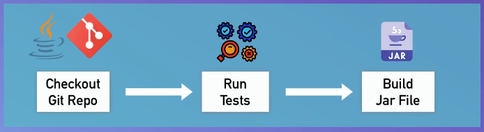

    * sync repo with credentials "https://gitlab.com/hamdiz0/java-maven-app.git" (branch:jenkins jobs)


    * job => configure => build environment => build steps => add build step : choose maven : 
        - goals : test (test app)
        - goals (add a second step) : package (package to jar file)


    * jenkins will checkout the git repo first ,run tests than package the app into a jar file (dependencies will be installed in the process)
    * a "target" folder is created containing the jar file


#                             [`Doker in Jenkins`]

## `setting up docker in jenkins` :
   
   * adding docker by attaching a volume to jenkins from the host
   * make sure you have docker installed in youre host machine
   * this achievd by mounting the docker runtime dir "/var/run/docker.sock" of the host to the jenkins container as a volume (previous container must be killed to add volumes) :

        - docker run -v /home/hamdi/jenkins:/var/jenkins_home \
        > -v /var/run/docker.sock:/var/run/docker.sock \
        > -p 8080:8080 -p 50000:50000 \
        > -u root jenkins/jenkins
        
   * start jenkins as container (change the volume mount "/home/hamdi/jenkins" to youre desired path in youre host machine)
   ```
      docker run -v /home/hamdi/jenkins:/var/jenkins_home -v /var/run/docker.sock:/var/run/docker.sock -p 8080:8080 -p 50000:50000 -u root --name jenkins -d jenkins/jenkins
   ```  
   * additional steps are needed (docker commands inside the jenkins container) : 
   ```
      docker exec -it jenkins bash
      curl https://get.docker.com/ > dockerinstall && chmod 777 dockerinstall && ./dockerinstall
      chmod 666 /var/run/docker.sock
   ```

## `build & push docker images` :

    * build a docker image of the "java-maven-app" :

        - docker build . -t hamdiz0/java-maven-app 

    * to push a docker image to a docker repo credentials must be added 
    * manage => credentials => store/system (of the related git repo credentials) => global credentials(unrestricted) => add credential

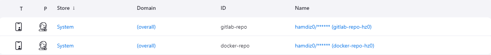
 
    * a plugin is needed to provide the user name and password of docker 
        * build environment => use secret text(s) or file(s) => username and password (seperated) => set user name (USER) and password (PASSWORD) variables

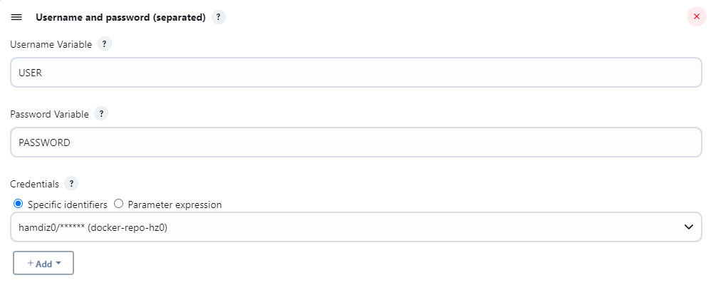

        - docker login -u $USER -p $PASSWORD
            - echo $PASSWORD | docker login -u USER --password-stdin (best practice)
        - docker push hamdiz0/java-maven-app


    * in order to push from jenkins to the nexus docker repo it must be secured first 
    * in the jenkins host where docker is installed (container or host where the actual docker installation exists) edit /etc/docker/docker.json :

        {
            "insecure-registries": ["<nexus-ip@>:<port>"]
        } 
            {
                "insecure-registries": ["192.168.1.16:8082"]
            }

    * check connection :

        docker login 192.168.1.16:8082

    * restart docker to add changes :

        - systemctl restart docker
        - chmod 666 /var/run/docker.sock (redo essantial changes after restart) 

    * add nexus credentials in jenkins (nexus user must have docker role permissions)
    * modify the script :

        docker build . -t <nexus-ip@>:<docker repo http port>/java-maven-app:1.1
        echo $PASSWORD | docker login -u $USER --password-stdin   <nexus-ip@>:<docker repo http port>
        docker push <nexus-ip@>:<docker repo http port>/java-maven-app:1.1
        
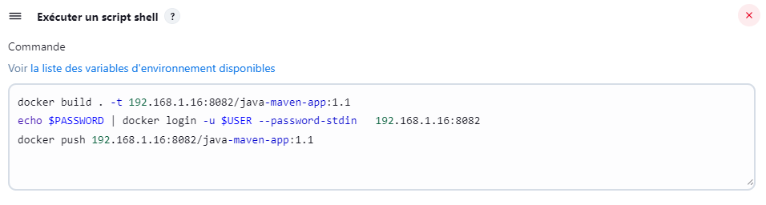   

#                             [`Freestyle to Pipline`]

## `Freestyle vs Pipline` :

    * running multiple steps (build ,package ,...) in a freestyle job is not considered a best practice so setting a single step per job is better
    * this is possible by chaining freestyle jobs 

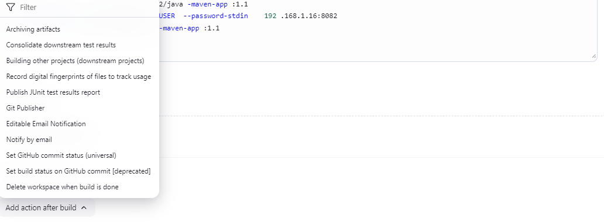

    * trigger another job after complition of the one before

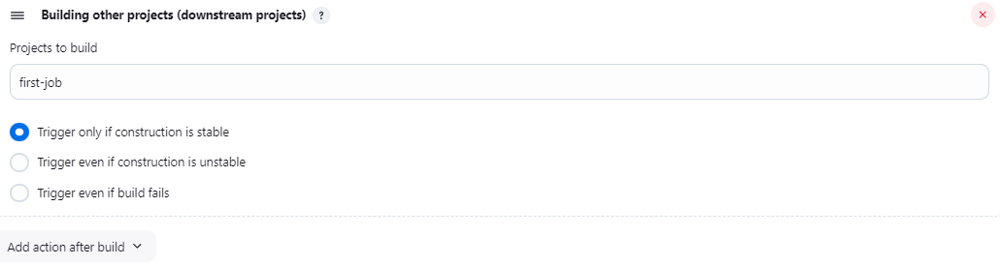 

    * this "chained freestyle jobs" type poses limitations like depending on the UI (plugins) wich by it self provides limitted options 
    * this not suitable for complex workflows 
    * this makes "pipline jobs type" a better option for it's flexibility:
        - suitable for CI/CD
        - scripting pipline as code 

## `Pipline` : 

    * pipline job require a script written in "groovy"
    * it's a best practice to add "jenkinsfile" wich contains the pipline configuration in the code manegement repo (SCM)

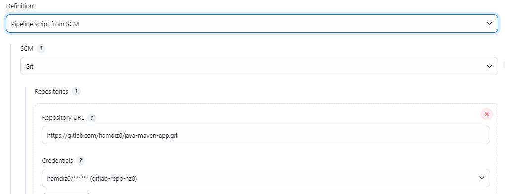 

#                             [`Pipline Syntax`]

## `scripted syntax` :

    * based on "groovy" with advanced scripting capabilities and high flexibility :
    * structure :

        node {
            // groovy script
        }

    * the "node" (scripted) definition is equivelent of "pipline + agent" (declarative)  
        
## `declarative syntax` :

    * easier to work with ,but dosen't have similar features like the scripted one
    * you have to follow pre-defined structure wich can be a bit limmiting 
    * "agent any" means the script can run on any available jenkins agent like a node ,an executer on that node ,etc (this is relevent for jenkins cluster "master and workers")
* structure :
```
    pipeline {      //must be top level
        agent any   //where to execute
        stages{     //where work happens
            stage( <stage name> "build"){
                steps {
                    // stage step commands
                }
            }
        }
        post { (these will execute ofter job completion)
            always {
                // post job step (send email)
            }
            success {
                // executes if the job was seccessfull
            }
            failure {
                // executes if the job was unseccessfull
            }
            ...
        }
    }
```
* you can add conditional expressions in the job stages :
```
    stages{     
        stage("test"){
            when { // when this stage will execute
                expression { // BRANCH_NAME is a jenkins predefined variable (for pipline use GIT_BRANCH ,BRANCH_NAME is only present for multibranch)
                    BRANCH_NAME == 'dev' // checks if the working branch is 'dev' else it this stage will not execute 
                    BRANCH_NAME == 'dev' || BRANCH_NAME == 'main' // either one
                }
            }
            steps {
                // stage step commands
            }
        }
    }
```
* you can define youre own variables and use them in the script :
```
    CODE_CHANEGES == getGitChanges() // a custom function with "groovy" script (example)
    pipeline {      
        agent any   
        stages{     
            stage("build"){
                when { 
                    expression {
                        BRANCH_NAME == 'dev' && CODE_CHANGES == true // this will run if the branch is dev and the custom function returns true
                    }
                }
                steps {
                    // stage step commands
                }
            }
        }
    }
```
## `jenkins environment variables` :

* you can find all jenkins env-vars in :
```
    <jenkins url|ip@>/env-vars.html/
    http://192.168.1.16:8080/env-vars.html/ 
```
* you can define you're own env-vars in the environment section:
```
    pipeline {      
        agent any
        environment {
            NEW_VERSION = '1.5.0'
            SERVER_CREDENTIALS = credentials('<credential id>') // a seperate plugin called "credentials binfding" is needed
        }
        stages {
            stage("build"){
                steps {
                    sh "env" // shows all environments vars
                    echo "building version ${NEW_VERSION}" // double quotes
                    }
            }
            stage("deploy"){
                steps {
                    echo "deploing with ${SERVER_CREDENTIALS}" 
                }
            }
        }
    } 
```
* another way to get credentials is by using the wrapper syntax this only avaible if the "Credentials" and the "Credentials Biding" plugins are avaible in jenkins :
```
    stage("deploy"){
        steps {
            echo "deploing to server"
            withCredentials([
                usernamePassword ( credentialsId:'<credential id>', 
                usernameVariable:'USER', // store user variable in USER
                passwordVariable:'PASSWORD',) // store password variable in USER
            ]) {
                sh "<script> ${USER} ${PASSWORD}" // pass USER and PASSWORD to a script
            }
        }
    }
```
## `tools` :
    
* this section is used to access build tools for a project (maven ,npm) :
```
    tools {
        <tool> <custom set name in the tools conf>
        maven "maven-3.9.9" 
        gradle 
        jdk
    }
```
* these tools must be preinstalled in jenkins 

## `parameters` :

* the parameter block is used to define input parameters for the pipline with can change the behavior of the jenkinsfile script 
```
    parameters {
        string(name:'<name>' ,defaultValue:'<value>' ,description:'<details>')
        choice (name:'<name>' ,choices:['choice1','choice2','choice3'] ,description:'<details>')
        booleanParam(name:'<name>' ,defaultValue: true|false ,description:'<details>')
        password(name: '<name>' ,defaultValue: '<value>' ,description:'<details>')
    }
```
* call parameters in youre expressions :
```
    stage('deploy') {
        when {
            expression {
                params.executeTests == true
            }  
        }
        steps {
            // step commands
        }
    }
```
## `external script` :

* you can add groovy scripts in the script block :
```
    stage("build") {
        steps {
            script {
                // groovy script 
            }
        }
    }
```
* any related groovy syntax commands and variables must be under the script block 
* add external groovy script (add a stage where you load youre scripts) :
```
    def gv // define the script variable
    pipline {
        agent any
        stages {
            stage("init") {
                steps {
                    script {
                        gv = load "script.groovy" // gv is a variable holding the imported script
                    }
                }*
            }
            stage("build"){
                steps{
                    script{
                        gv.build() // call a function from the imported script
                    }
                }
            }
            
        }
    }
```
* all environment variables and paramaters are avaible and accessable by the script (you can declare them in the actual external groovy script)

## `replay build option` :

    * #<build number> => replay
    * you can add and test changes with out pushing to the git repo

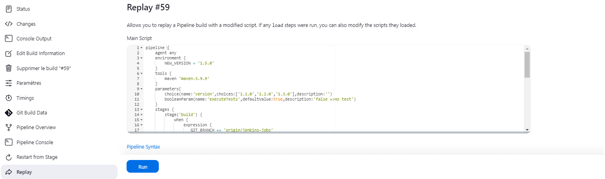

## `user input` :
```
    stage("<name>") {
        input {
            message "<meassage>"
            ok "<message>"
            parameters { 
                // parameters added here will only work under this stage (scoped parameters)
            }
        }
        steps {
            script{
                    echo "${variable}" //variable name not params.variable
                }
        }
    }
```    
* assining user input to a variable (script block only) :
```
    script {
        env.ENV = input message: "<message>" ,ok: "<message>" ,parameters: [<parameter>] 
    } 
```
## `credentials` :
    
    * administer => credentials => add credentials
    * there is 3 types of credentials in jenkins :
        - global : avaible for evry job type
        - system only : avaible for system addmins
        - multibranch scoped : only avaible for a particular multibranch pipline

#                             [`MultiBranch`]

    * multibranch is used for multibranch git repos ,it basicly sets a seperate pipline for each branch

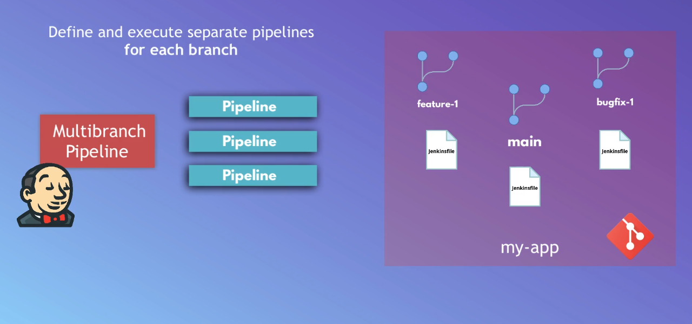

## `branch scanning` :

    * dicvover branchs based on a specifc option like regular expressions 
    * create a pipline based on the branch type (bug-fix ,features)

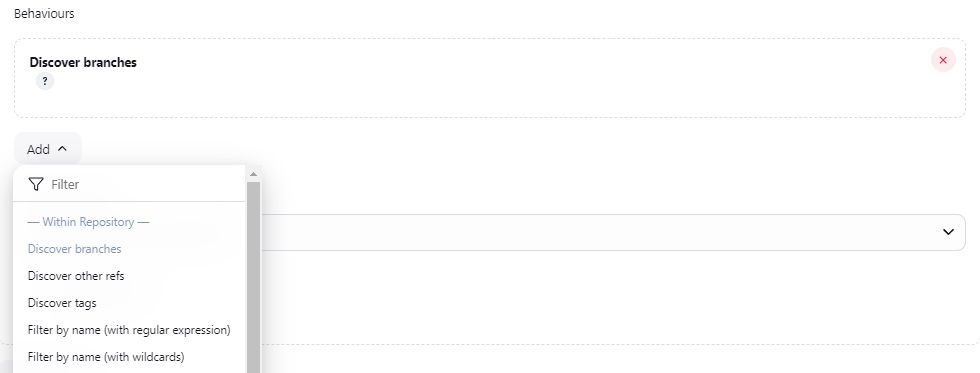

    * filter branchs based on regular expression (click "?" for help)

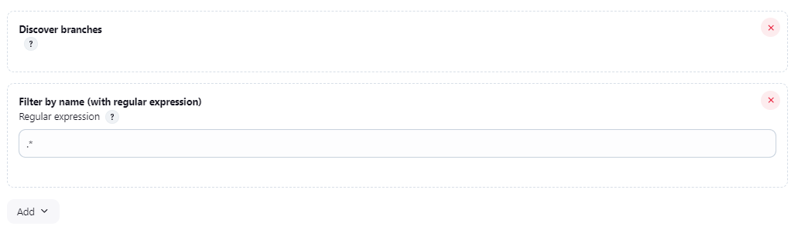

    * every branch must have a "jenkinsfile" preferably the same each

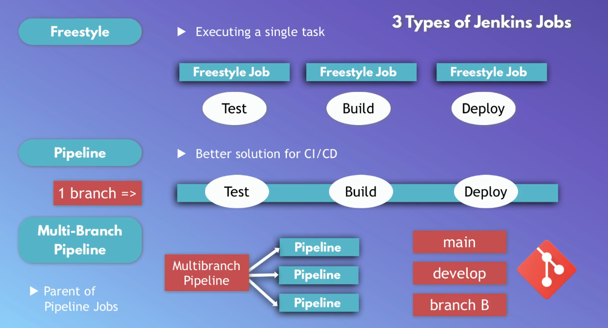

    * you can add scoped credentials particular to a multibranch pipline 

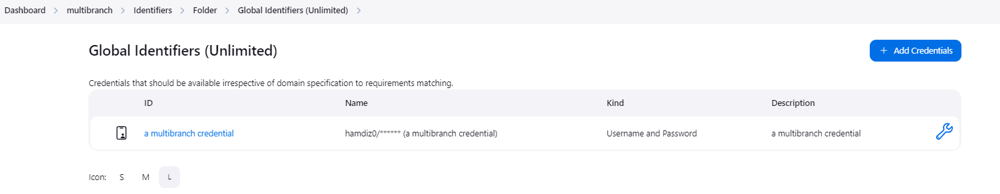

#                             [`Shared Library`]
    
    * used to share parts of piplines between various projects to reduce duplication
    * shared libraries can be defined in external git repositories and loaded into existing pipelines
    * it's written in groovy script
    * you can write the logic that's going to be shared accross applications in a shared library and reference that logic in jenkins file for each project
    * share logic using a shared library between micro services as they usually share the same logic base (java for example)
 
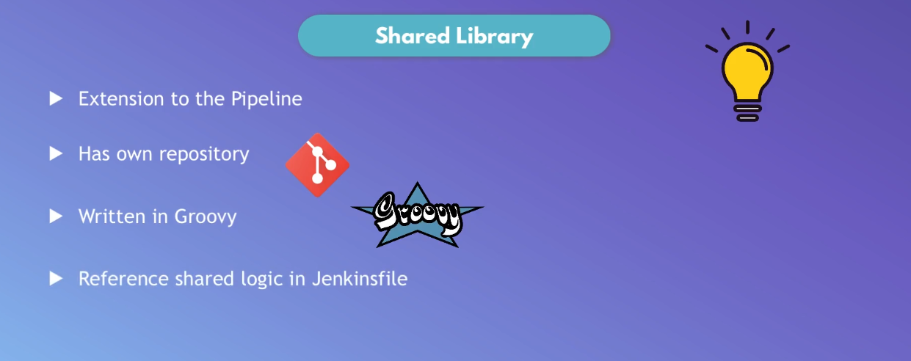

    * share logic between multiple projects (company) regardless if they share the same logic base (tech stack) or not


    * this improve collaboration through sharing 

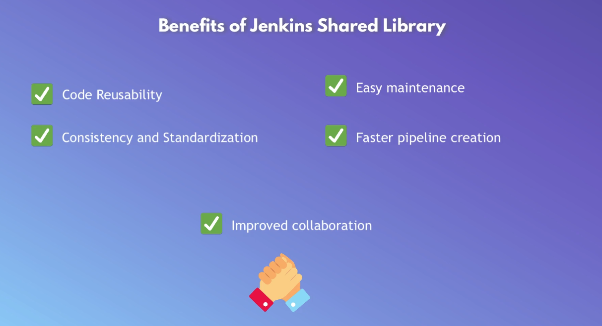

## `creating a shared library` : 

    * create a git repo 
    * write the groovy code
    * share the library globally or for a project
    * use the shared library in jenkins file to extend the pipeline
 


    * vars folder containes functions ,each function/step has it's own groovy script file and can be called from the jenkinsfile
    * src folde for helper code
    * resources folder for libraries and other files

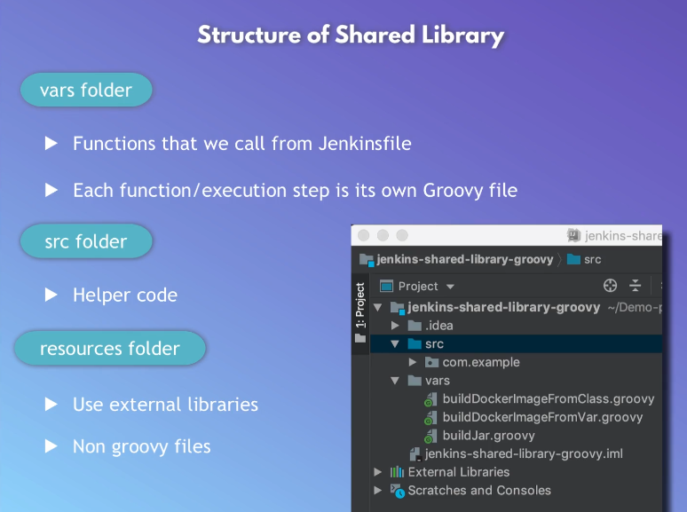

    * create a groovy script for each function (sharable logic) under vars :

        #!/user/bin/env groovy (ensure that the script will execute correctly)
        def call () {
            // function logic
        }  

    * making a shared library globaly avaible 
    * dashboard => administer jenkins => system => global 

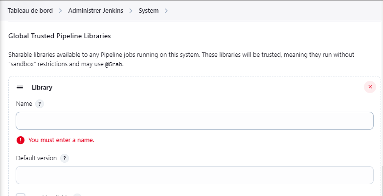

## `using a global shared library` :

* in the jenkins file of a pipline :
```
    @Library('<shared library name>')_ // add the '_' if the pipline is after
    pipline {...}
    @Library('<shared library name>') // no need to add the '_'
    def gs
    pipline{...}
```
* calling functions from a shared library :
```
    stage("build"){
        steps{
            script{
                <file name of the function under vars>()
                jarBuild()
            }
        }
    }
```
## `using a scoped shared library` :

* a shared library for a specific pipline 
* in the jenkins file of the pipline :
```
    library identifier: 'jenkins-scoped-library' ,retriever: modernSCM(
        [$class:'<name>' ,
        remote: '<repo-url>',
        credentailsId:'<credentails id>']
    )
```
## `adding parameters to a function` :

* adding parameters for a function in a shared library is convinient cause it makes it more general :
```
    #!/user/bin/env groovy
    def call(
        String <variable>
    ){
        sh "deploy $<variable>" // double quotes ("") for this to work
    }
```
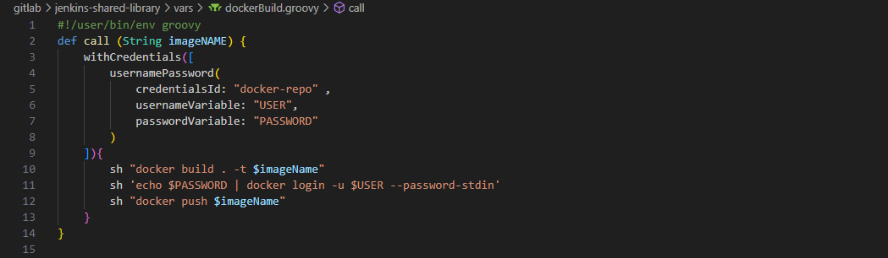

* calling a function with parameters :
```
    script {
        <file name of the function> '<value>'
        dockerbuild('hamdiz0/va-vote','1.0','docker-repo','./vote')
    }
```
## `shared library class` :

* creating a class that function groovy files inherit from 
* create a groovy package "<PackageName>/<CalssName>.groovy" :
```
    #!/user/bin/env groovy
    package <PackageName> // "com.example" containing folder of the class groovy file
    class <ClassName> implements Serializable { // saving the state of the execution if the pipeline is paused and resumed
        def script
        <ClassName>(script){
            this.script = script
        }
    }
    def <Function> (<parameters>) {
        // function logic
    }
```
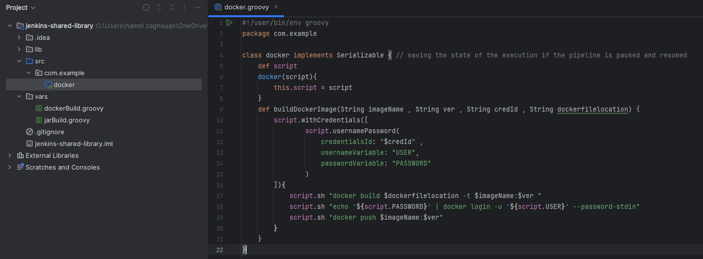

* importing class logic to a function groovy file :
```
    import <PackageName>.<CalssName>
    def call (<parameters>){
        return new <CalssName>.<Function>(<parameters>)
    }
```
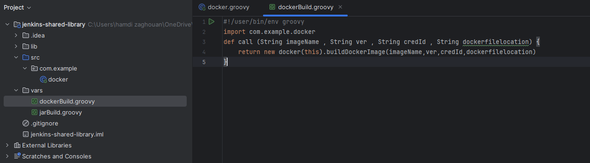

#                             [`Job Triggers`]

    * a job in jenkins can be triggered/built manually or automaticly by using git repo commits or scheduling

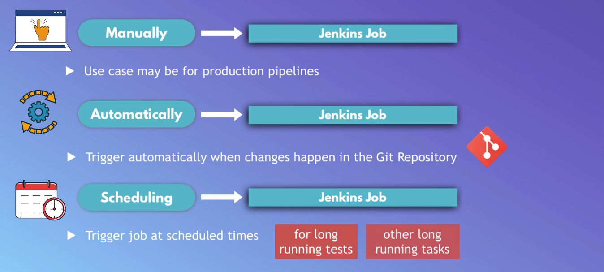

## `using git commits` :

    * use "ngrok" if jenkins is running on a localhost :
        - ngrok http <host>:<port>
        - ngrok http localhost:8080
    * in webhook payload field put "ngrok/jenkins-url/github-webhook"
* ngrok gives one random free dns name when u create an account <a href="https://ngrok.com/">visit ngrok</a> :
```
    ngrok http <port on youre local machine you want to forward> --url=<ngrok free dns url>
```
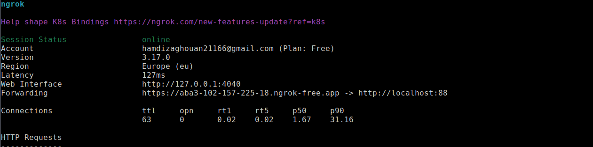

### `github` :

    * for each repo in github you can add a webhook

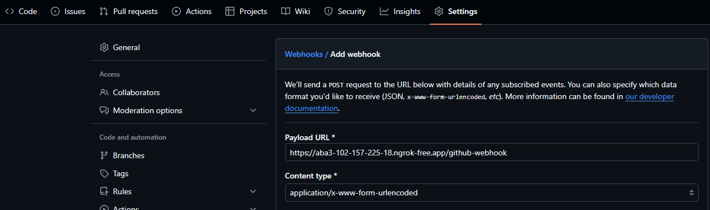

### `gitlab` :

    * install gitlab plugin 
    * add an api token in gitlab 

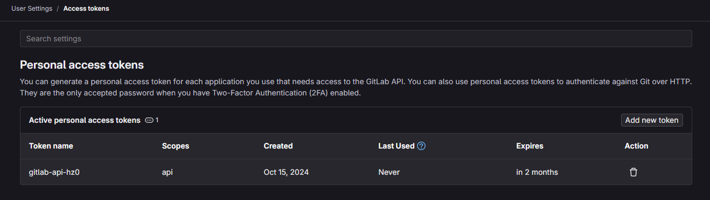

    * create and add a connection to a gitlab in jenkins

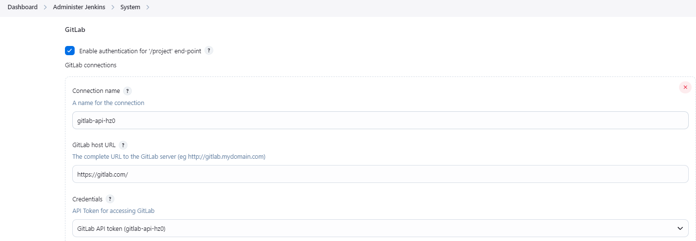

    * trigger builds with pushes

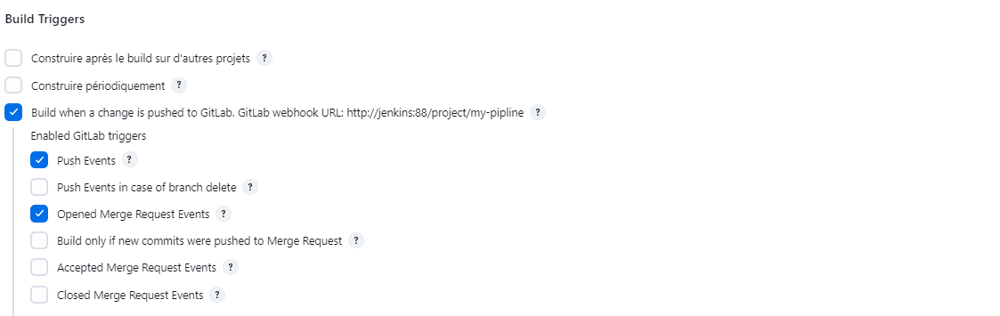

    * for each repo in gitlab you can add jenkins integration
    * in the integration settings add jenkins url ,project/job name ,username and password

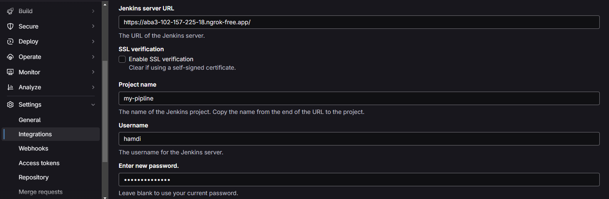

## `multibranch triggers` :

    * a plugin called "Multibranch Scan Webhook Trigger" must be installed

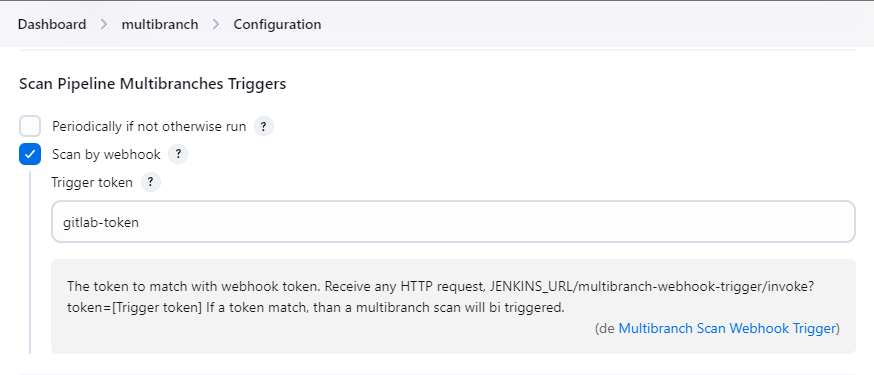

    * create a webhook in the git repo setting with url :
        - <JENKINS_URL>/multibranch-webhook-trigger/invoke?token=<Trigger token>
        - https://09e6-102-157-32-128.ngrok-free.app/multibranch-webhook-trigger/invoke?token=gitlab-token

<br>

    * gitlab :

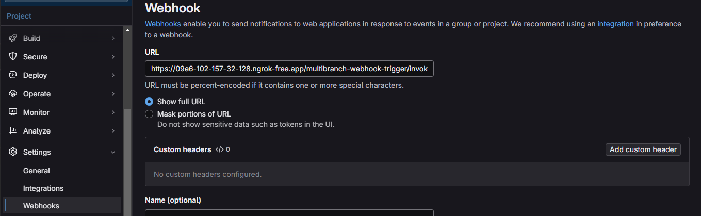

    * github :

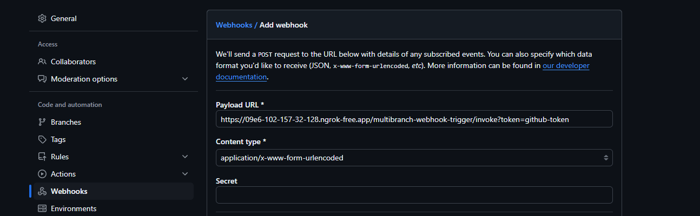

#                             [`Versioning`]

## `major.minor.patch` :

    * each package manager tool keeps a version of an application
    * a software version is split on 3 parts :
        - major : big breaking changes (no rollbacks/not backward compatible)
        - minor : new chages that are backward compatible (api features)
        - patch : small changes and bug fixes (no api changes) 
    * major.mino.patch  : 1.3.2

## `suffixs` :

* suffixs are used to give more information to the version : 
```
    <version>-<suffix>
    SNAPSHOT : for test versions
    RELEASE : for release versions
```
## `incrementing version for java-maven-app` :

### `build/app version` :

* evry build tool have some kinde of tool or plugin to increment version for maven :
```
    mvn build-helper:parse-version version:set 
    -DnewVersion=
    \${paresedVersion.majorVersion} // nextMajorVersion
    .\${paresedVersion.minorVersion} // nextMinorVersion
    .\${paresedVersion.nextIncrementalVersion} // incrementalVersion
    versions:commit
```
* adding the incrementing script to a jenkinsfile 
* use "\\\${<variable>}" so the script dosen't comfuse maven vars with global ones :
```
    def incrementVersion() {
        echo 'incrementing app version ...'
        sh 'mvn build-helper:parse-version versions:set \
        -DnewVersion="\\\${parsedVersion.majorVersion}.\\\${parsedVersion.minorVersion}.\\\${parsedVersion.nextIncrementalVersion}" \
        versions:commit'
    }    
```
### `docker image version` :

* a common practice is to set the docker image version same as the app version:
```
    stage('increment version'){
        steps{
            script{
                echo 'incrementing app version ...'
                sh '...'
                def <variable> (match) = readFile('pom.xml') =~ '<version>(.+)</version>'
            }
        }
    }
```
* readFile searches for a match of the line '<version>content</version>' to retrieve the version and set it to a variable
* '(.+)' this regular expression tells the script to retrieve all lines no matter what content between '<version>...</version>'
* the variable stores an array of all matches and each match has its own content wich can be multiple elements 
* you select the first line match that holds the app version with index '0' and its content the version wich is the first element '1' :
```
    match[0][1] // holds the app version
    def version = match[0][1]
```
* creating docker image version and appending build number :
```
    stage('increment version'){
        steps{
            script{
                echo 'incrementing app version ...'
                sh 'mvn build-helper:parse-version versions:set \
                -DnewVersion="\\\${parsedVersion.majorVersion}.\\\${parsedVersion.nextMinorVersion}" \
                versions:commit'
                def match = readFile('pom.xml') =~ '<version>(.+)</version>'
                def version = match[0][1]
                env.IMAGE_VERSION = "$version"
            }
        }
    }
    stage("build image"){
        steps {
            script{
                dockerBuild('hamdiz0/java-maven-app',"$IMAGE_VERSION",'docker-repo','.')
            }
        }
    }
```
* dockerfile require changes so it can build the new packeged app with the new version :
```
    FROM openjdk:8-jre-alpine
    EXPOSE 8080
    COPY ./target/java-maven-app-*.jar /usr/app/ ("*" : current version)
    WORKDIR /usr/app
    CMD java -jar java-maven-app-*.jar 
```    
* old version jar files must be deleted before the build to avoid file comfusion cause "*" select all files :
```
    mvn clean package 
```
### `commiting changes to github` :

* add a github token and create credentails
* configure git user name and email in jenkins container :
```
    docker exec -it <jenkins container name|id> bash
    git config --global user.name "jenkins"
    git config user.email "jenkins@jenkins.com"
```
* add a stage for pushing changes :
```
    def git_push(String url , String credId , String commitMsg, String toBranch){
        echo 'pushing to $toBranch ...'
        withCredentials([
            usernamePassword(
                credentialsId:"$credId",
                usernameVariable:'USER',
                passwordVariable:'TOKEN'
            )]){
            sh "git remote set-url origin https://${USER}:${TOKEN}@$url"
            sh "git add ."
            sh "git commit -m \"${commitMsg}\"" 
            sh "git push origin HEAD:$toBranch"
        }
    }

    stage("push changes"){
        steps{
            script{
                gs.git_push(
                    'github.com/hamdiz0/java-maven-app.git', //url without "https://"
                    'github-api-hz0', //credentialsId
                    "updated to version ${IMAGE_VERSION}", //commit message
                    'main' //branch
                )
            }
        }
    }      
```
* if the repo is webhoked to jenkins the build will enter a loop of commiting and building 
* for multibranch you can use a pluggin called "ignore commiter strategy" 
* dont forget to check the "Allow builds when a changeset contains non-ignored author(s)" ckeckbox
* for normal piplines you need to another stage that checks jenkins commits :
```
    stage('Check for jenkins commit') {
        steps {
            script {
                // find the latest committer's email
                def committerEmail = sh(script: 'git log -1 --pretty=%ae', returnStdout: true).trim()
                
                echo "Committer email: ${committerEmail}"

                // check if the committer email is Jenkins'
                if (committerEmail == 'jenkins@jenkins.com') { // jenkins git configured email
                    echo "Skipping build due to Jenkins commit"
                    currentBuild.result = 'SUCCESS' // set build result to success
                    error('Stopping build due to Jenkins commit') // stops the build with an error
                }
            }
        }
    }
```


