# Kubernetes

* kubernetes is a container orchestration tool
* automating deployment ,scaling and management of containerized apps

# [`contatiner orchestration`] :

* container orchestration is a process that automates the container lifecycle of containerized apps :
    - deployment
    - manegement
    - scaling
    - networking 
    - availability
* container orchestration is critical part of an organization's security ,orchestration, automation and response (SOAR) requirements

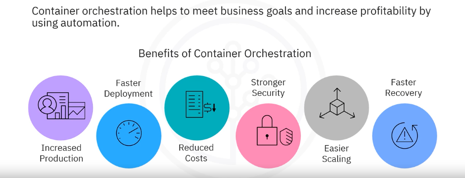

# [`k8s concepts`] :

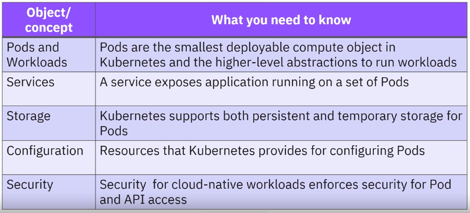
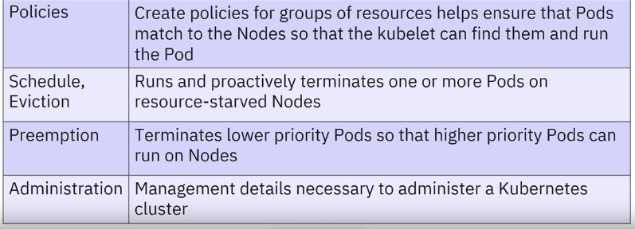

# [`k8s Architecture`] :

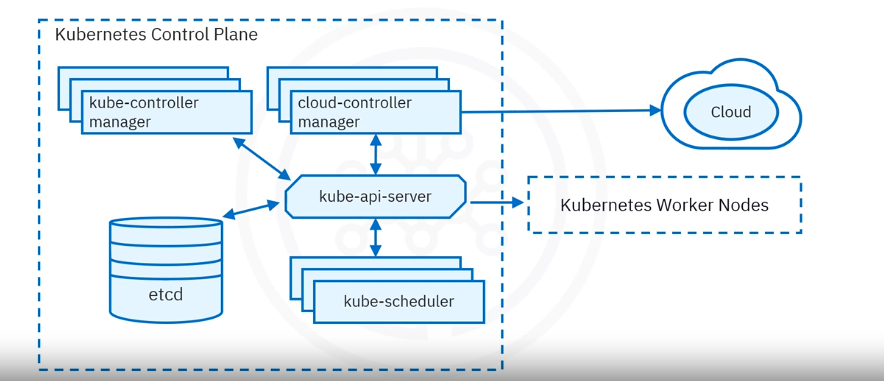

* `kube-api-server`:
    - Exposes the Kubernetes API
    - Front-end for the Kubernetes control plane
    - All communication in the cluster utilizes this API
    - Designed to scale horizontally and balance traffic
* `etcd` :
    - Highly available, distributed key-value store that contains all cluster data
    - Stores deployment ,configuration data ,the desired state and meta data 
* `schduler` :
    - Assigns newly created Pods to nodes
    - Selects optimal node according to Kubernetes scheduling principles, configuration options, and available resources
* `kube-controller-manager` :
    - Monitor cluster state
    - Ensure the actual state matches the desired state
* `cloud-controller-manager` :
    - Runs controllers that intreract with cloud providers
    - link clusters to a cloud provider's API 

---

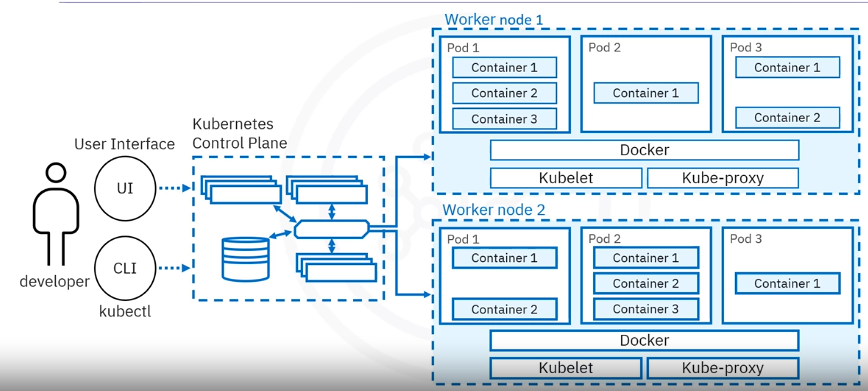

* `nodes` :
    - Are the worker machines (virtual or physical) in Kubernetes
    - Managed by the control plane 
    - Contain the services necessary to run applications
    - Nodes include pods which are the smallest deployment entity in Kubernetes
* `pods` : 
    - pods include the working containers
* `kubelet` :
    - Communicates with the API server
    - Ensure that pods and their associated containers are running
    - Reports to the control plane on the pods' health and status
    - in order to start a pod the kubelet uses the contatiner runtime (docker)
* `contatienr runtime` :
    - Downloads images and runs contaitners
    - k8s implements an interface so that this componenet is pluggable
* `kube-proxy` :
    - Mantains network rules that allow communication to pods  
    - communication to workloads running in a cluster

# [`k8s objects`] :

* Kubernetes objects consist of two main fields 
    - object spec :
        * provided by user
        * defines desired state
    - status :
        * provided by kubernetes
        * defines current state
    - kubernetes works towards matching the current state to the desired state
* Labels and Selectors :
    
    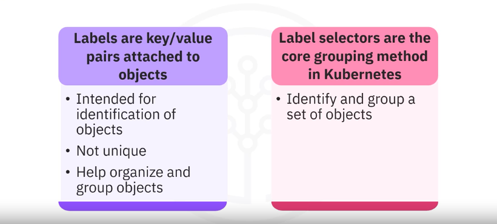 
    
* `Namespaces and names` :
    - provide a mechanism for isolating groups of resources within a single cluster
    - segregate cluster by team ,project ,etc 
    - necessary with larger numbers or users

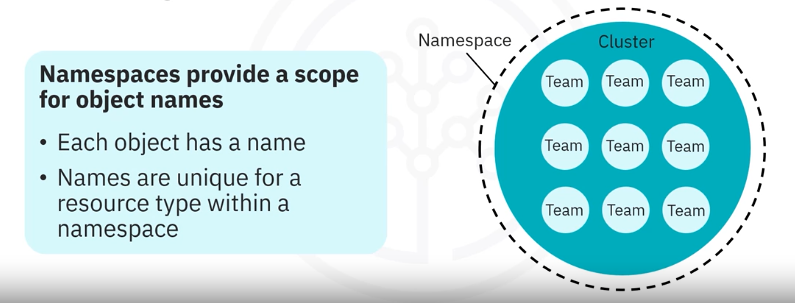

* `Pods` :
    - simplest unit in kubernetes 
    - represents processes running on a cluster
    - encapsulates one or more contaitners
    - replicating a pod serves to scale applications horizontally
    - example file.yml :
    ```
        apiVersion: v1
        kind: Pod
        metadata:
            name: nginx
        spec:
            containers:
            - name: nginx
              image: nginx:latest
              ports:
              - contatinerPort: 80
    ```
* `ReplicaSet` :
    - a set of horizontally scaled running Pods
    - it's configuration file defines:
        * Number of replicas 
        * Pod template
        * Selector to identify which Pods it can acquire
    - example file.yml :
    ```
        apiVersion: apps/v1 
        kind: ReplicaSet 
        metadata:
            name: nginx-replicaset 
            labels:
                app: nginx
        spec:
            replicas: 3 
            selector: // wich Pods to be acquired 
                matchLabels: 
                    app: nginx
            template: // Pod template
                metadata: 
                    labels:
                        app: nginx
                spec:
                    containers:
                    - name: nginx
                      image: nginx:1.7.9 
                      ports:
                      - containerPort: 80
    ```
    - Generally encapsulated by a Deployment
* `Deployment` :
    - a deployment is higher-level object that provides updates for Pods and ReplicaSets (a blueprint)
    - run multiple replicas of an application 
    - suitable for stateless applications
    - update triggers a rollout (a rolling update scales up a new version to the appropriate number of replicas and scales down the old version to 0 replicas)
    - file.yml example:
    ```
        apiVersion: apps/v1 
        kind: Deployment 
        metadata:
            name: nginx-deployment
            labels:
                app: nginx
        spec:
            replicas: 3 
            selector:
                matchLabels: 
                    app: nginx
            template: 
                metadata: 
                    labels:
                        app: nginx
                spec:
                    containers:
                        name: nginx
                        image: nginx:1.7.9 
                        ports:
                            containerPort: 80
    ```
* `Service` :
    - a REST object similar to Pods
    - a logical abstraction for a set of pods in a cluster
    - provide policies for accessing the Pods and cluster
    - acts as load balencer across the Pods (forwards request to the less busy Pod)
    - eash service is assigned a unique IP@ for accessing applications deployed on Pods
    - why service is needed :
        * Pods are volatile wich leads to discoverability issues because of changing IP@
        * services keep track of Pod changes and exposes a single IP@ or a DNS name
        * utilizes selectors to target a set of Pods
    - Service Types (4):
        * ClusterIP : 
            - internal
            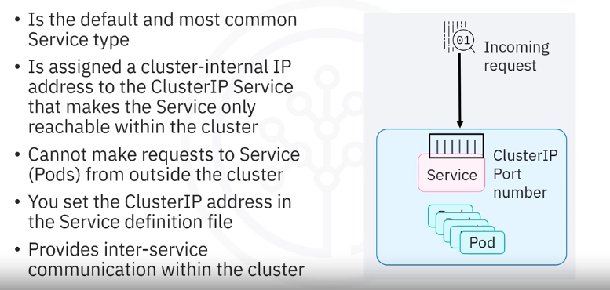

        * NodePort :
            - external            
            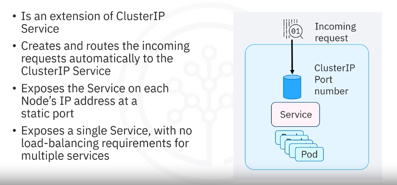

        * ELB(External Load Balancer) :
            - external
            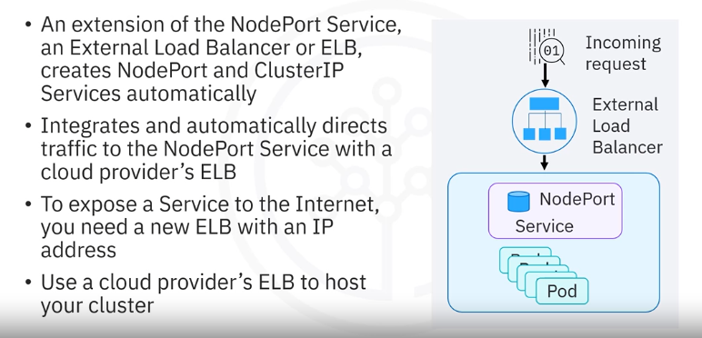

        * External name :
            - external
            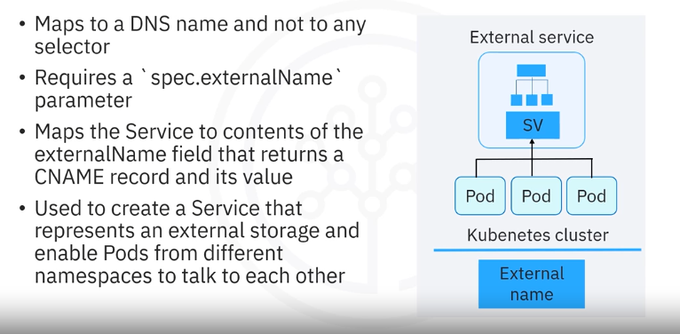

    - basicly a wrap with persisting settings (IP@ ,...)
* `Ingress` :
    - forwards connection outside/inside the kube internal network
    


* `DaemonSet` :
    - adjust replica-number when adding/decreasing Nodes
    - ensure that Pods are equally distributed across deployments
    - deploys one replica per node


* `StatefulSet` :
    - used specificly for apllication like databases
    - basicly Deployment but for data-base services
    - data-bases are often hosted outside of the k8s cluster avoiding the StatefulSet
    - manages the deployment and scaling of a set of pods
    - maintains a sticky identity for each of their Pods
    - ensure that each Pod has a persistent identity and storage

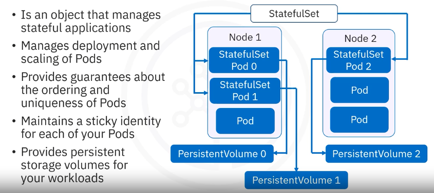

* `Job` :

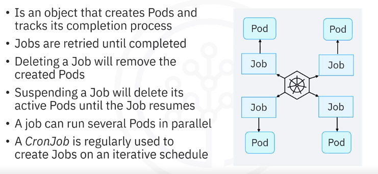

* `Config Map` :
    - map external configuration to an application
    - connected to a Pod so that it can retrieve the configuration
    - avoid rebuilding ,pushing the image ,pulling in the pod evry time a change happens 
* `Secret` :
    - store credentials
    - require third party encryption tools (cloud providers, ...)
    - or reference secret inside deployment/pod (environment vars ,proprities file ".env")
* `volumes` :
    - persist data locally/remotely

# [`kubectl`] :

## `commands` :

* command structure :
    - kubectl <command> <type> <name> <flags> 
    - <command> : create ,get ,delete ,apply ,...
    - <type> : pod ,deployment ,replicaset ,...
    - <flags> : special options that override the default values ()
* create and run a Pod :
    ```
    kubectl run <name> --image=<container-image> --restart=Never
    ```
    - (--restart=Never) pod will not restart automatically if it stops for any reason 
* create a deployment :
    ```
    kubectl create deployment <name> --image=<container-image>
    ```
* expose a deployment as a service :
    ```
    kubectl expose deployment <deployment-name> --port=<port number> --type=NodePort --name=<name>
    ```
    - (--type) : NodePort ,ClusterIP ,ELB ,External name
* statefullstes :
    ```
    kubectl create statefulset <name> --image=<container-image> --replicas=<number>
    ```
* generate a file.yaml from a command :
    - add (--dry-run=client -o yaml > service.yaml) to create a file from a command
    ```
    kubectl create statefulset my-statefulset --image=nginx --replicas=3 --dry-run=client -o yaml > statefulset.yaml
    ```
* delete an object :
    - kubectl delete <object-type> <name>
    - <objct-type> : services/pods/deployments/...
    - kubectl delete <object-type> --all
    ```
    kubectl delete pod <pod-name>
    ```
    ```
    kubectl delete services --all
    ```
* get object information :
    ```
    kubectl get <object-type> 
    ```
* get logs :
    ```
    kubectl logs <pod-name>
    ```
* Label an object :
	- Labels let you query and filter objects in your cluster
    ```
    kubectl label <object-type> <name> <key>=<value>
    ```
## `configuration files` :

### pod definition :
```
apiVersion: v1                  # v1 for pods and services
kind: Pod                       # object type
metadata:                       # provide information about the object
  name: my-pod
  labels:                       # labels assigned to this object
    app: my-app                 # this object belongs to "my-app" app
    env: production
spec:                           # object configuration
  containers:
    - name: nginx-container
      image: nginx:latest
      ports:
        - containerPort: 80
```
### service definition :
```
apiVersion: v1
kind: Service
metadata:
  name: my-service
  labels:
    app: my-app
spec:
  selector:                     # defines the label selector used to match pods managed by this object
    matchlabels:                # tell the object to manage pods with these labels
      app: my-app               
  ports:
    - protocol: TCP
      port: 80
      targetPort: 80
  type: ClusterIP               # service type
```
### deployment definition :
```
apiVersion: apps/v1             # apps/v1 for deployments ,statefulsets and deamonsets 
kind: Deployment
metadata:
  name: my-deployment
  labels:
    app: my-app
spec:
  replicas: 3
  selector:
    matchLabels:                
      app: my-app
  template:                     # The template block describes the pod template for each replica in this object (what each pod should contain)
    metadata:                   # pod metadata
      labels:
        app: my-app
    spec:
      containers:               # pod configuration
        - name: nginx-container
          image: nginx:latest
          ports:
            - containerPort: 80    
```
### statefulset definition :
```
apiVersion: apps/v1
kind: StatefulSet
metadata:
  name: my-statefulset
  labels:
    app: my-app
spec:
  serviceName: "my-service"     # defines the headless Service name for the StatefulSet Pods
  replicas: 3
  selector:
    matchLabels:
      app: my-app
  template:
    metadata:
      labels:
        app: my-app
    spec:
      containers:
        - name: my-container
          image: nginx:latest
          ports:
            - containerPort: 80
          volumeMounts:
            - name: my-storage
              mountPath: /data  # mounts the storage volume at /data inside each Pod
  volumeClaimTemplates:         # create a separate volume for each Pod replica from this template
    - metadata:
        name: my-storage        # name of the persistent volume claim
      spec:
        accessModes: [ "ReadWriteOnce" ]  # each Pod can read/write to the volume
        resources:
          requests:
            storage: 1Gi        # one GB of storage
```
### daemonset definition :
```
apiVersion: apps/v1
kind: Deployment
metadata:
  name: example-deployment
spec:
  replicas: 3
  selector:
    matchLabels:
      app: example
  template:
    metadata:
      labels:
        app: example
    spec:
      containers:
      - name: example-container
        image: nginx
```
### apply configuration files :
```
kubectl apply -f file.yaml
```

# [`ingress`] :

* ingress manages external access to cluster services and it has 2 main parts :
    - ingress objects : defines traffic routing rules 
    - ingress controllers : implements rules using load balancers or frontends

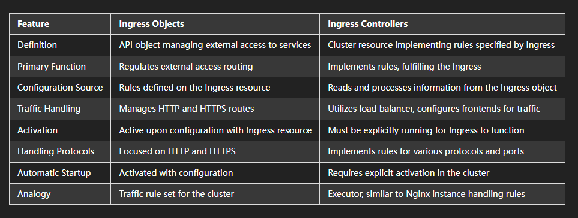

# [`antipatterns`] :

* avoiding <a href="src/antipatterns.md">Antipatterns</a> is crucial for maintaining a robust container orchestration environment 

