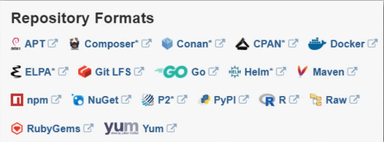

#                             [`NEXUS`]
	
	* nexus is an artifact repo manager

## `artifacts` :

	* artifacts are apps built into a single file (multiple app source code in one file)
	* an artifact may have multiple formats : jar ,zip ,tar ,...

## `artifact repo manager` :

	* this is where you store or upload artifcats as long as it supports the artifact file format
	* each format has its own repo (nexus supports multiple formats)
	* you can also retrieve stored artifacts (a centrale storage) 
	* you can host youre own repos (private) ,set up proxy repos (retrieve public repos and acces artifacts from nexus)
	* it's best practice to manage all artifact repos in one spot and nexus provides that

## `features of nexus` :

	* integration with "LDAP" : configure access manegement and permissions
	* flexible and powerfull "REST" api for integration with other tools (like jenkins and gitlab) so basicly its an essantial part in the CI/CD pipline 
	* push artifacts (jenkins) to nexus than pull and deploy to a deployment server

	
	* back up and restore features that manages storage and artifact load
	* multi-format support

	* metadata tagging (label and tag artifact realeases like dev or release versions)
	* cleanup policies (remove old uneeded artifacts and save space) ,this can be automated (weekly ,monthly)
	* search functionality across projects and artifact repos to retrieve the desired version 
	* user token support (non human user authentication) wich helps with integration in the CI/CD pipline

#                             [`Setting up Nexus`]
	
	* download tar file from "https://sonatype-download.global.ssl.fastly.net/repository/downloads-prod-group/3/nexus-3.72.0-04-unix.tar.gz"
		- wget <url>
	* untar the file :
		- tar -zxvf <tar file>
	* it's better to set a nexus user that manages the nexus data :
		- useradd nexus 
	* change the "nexus-version" and "sonatype-work" folders ownership with thier content :
		- chown -R (recursive) nexus:nexus nexus-version
		- chown -R nexus:nexus sonatype-work
	* java must be installed on the machine :
		- apt install openjdk-17-jdk openjdk-17-jre
	* start nexus :
		- nexus-version/bin/nexus start
		- ps aux | grep nexus (check nexus is running)
	* display info about listening network services :
		- netstat -lnpt
	* nexus service is listening on port 8081 ,nexus hosting server must be configured to allow in/outbound port 8081 traffic

#                             [`Repo Types`]

## `proxy repo` :

	* a repo that is linked to a remote one (maven-central)
	* nexus will check if the needed artifact is cached locally if not it will redirect the request to a remote repo and stored it locally and this will save time 

## `hosted repo` :

	* a private internal repo owned by a company

## `group repo` :

	* a combination of hosted and proxy repos in a single URL making it easier to manage access to multiple repos at once

#                             [`Creatinng a Repo`]

	* admin conf => repository => repositories => add repo based on the desired format and type

#                             [`Creating an Authorized User`]

	* you can add users from the company system and configure acces permessions using the LDAP nexus integration 
	* admin conf => users => create user 
	* roles are needed to provide the minimum amount of permissions needed for a certain task
	* admin conf => security => roles => create role
	* privelige format : 
		- nx-repository-<View | Admin (for admin preveliges)>-<repo name>-<Central | Public | Snapshot | Release>-<* (all preveliges) ,delete ,edit ,read>
	* admin preveliges are usually for the admins of nexus hwo take care of backups and plugins in nexus
	* normal user are usaully devs hwo want to upload or retrieve artifacts
	* "View" preveliges are enuf for uploading and retrieving nexus repos
	* it make sense to only give "Snapshot" priveliges to normal user as they can deploy thier unstable releases
		- nx-repository-view-maven2-maven-snapshots-*
	* the created role is now assinable to any user

#                             [`Uploading Jar Files to Nexus (Maven & Gradle) `]

## `using gradle` :

	* uploading a jar file to an existing repo on nexus requires configuring "Nexus Repo URL" and "Credentials" 
	* not the credantials of the admin but rather the users that have upload permissions
	* after creating an authorized user ,configs must be added to the "build.gradle" :
		- apply plugin: 'maven-publish'
		- publishing { (what to publish)
			publications {
				maven(MavenPublication){
					artifact("build/libs/my-app-$version"+".jar"){
						extention 'jar'
					}
				}
			}
			repositories { (where to publish)
				maven { 
					name 'nexus'
					url "http://<nexus ip>:<nexus port>/<path to repo>"
						"http://192.168.1.16:8081/repository/maven-snapshots/"
					allowInsecureProtocol = true (allows http traffic)
					credentials {
						username project.<username-property>
						password project.<password-property>
					}
				}
			}
		}
	* user name and password must be added to a "gradle.properties" file not directly in the "build.gradle" file (checked into version control) 
	* gradle.properties :
		- <username-property> = <username>
		- <password-property> = <password>
	* set the same name "my-app" ("build/libs/my-app-$version"+".jar") in the settings.gradle : 
		- rootProject.name = 'my-app'
	* build the project :
		- gradle build
	* publish to repo :
		- gradle publish

## `using maven` :

	* basicly same process like gradle :
	<build>
		<plugins>
			<plugin> (define a new plugin)
				<groupId>org.apche.maven.plugins</groupId>
				<artifactId>maven-deploy-plugin</artifactId>
				<version>3.1.1</version>
			</plugin>

			<plugin> (use the plugin)
				<groupId>org.apche.maven.plugins</groupId>
				<artifactId>maven-deploy-plugin</artifactId>
			</plugin>
		</plugins>
	<build>
	* add nexus information :
		<distributionManagement>
        	<snapshotRepository>
            	<id>nexus-snapshots</id>
            	<url>http://192.168.1.16:8081/repository/maven-snapshots/</url>
        	</snapshotRepository>
    	</distributionManagement> 
	* adding credentials to allow accessing nexus 
	* in /home/user/.m2 create a "settings.xml" file this is where all maven settings can be modified including credantials for all maven projects :
		<settings>
    		<servers>
        		<server>
            		<id>nexus-snapshots</id>
            		<username>hamdi</username>
            		<password>hamdi</password>
        		</server>
    		</servers>
		</settings>
	* to avoid the annonation error when building add :
		<dependency>
            <groupId>javax.annotation</groupId>
            <artifactId>javax.annotation-api</artifactId>
            <version>1.3.2</version>
        </dependency>
	* build and deploy :
		- apt install maven
		- mvn package
		- mvn deploy

#                             [`Nexus API`]

	* query nexus repo for different information :
		- components
		- rpositoreis
		- versions
	* these informations are required in CI/CD piplin build automation 
	* fetch these informations to programaticly set the name and the version of an artifact to deploy it to an environment

## `access the REST endpoint of nexus` :  

		* curl & wget http request 
		* show the list of avaible repos (authorized) :
			- curl -u <nexus-user>:<nexus-user-password> '192.168.1.16:8081/services/rest/v1/repositories'
		* show components of a specific repo :
			- curl -u <nexus-user>:<nexus-user-password> '192.168.1.16:8081/services/rest/v1/components?repository=<nexus-repo>maven-snapshots'
			- grep -E "id|path|name"
		* show a specific component :
			- curl -u <nexus-user>:<nexus-user-password> '192.168.1.16:8081/services/rest/v1/component/<component-id>'

#                             [`Blob Storage`]

	* nexus sotre uploded files locally or in the cloud (S3)
	* blob store can be specific for a single repo or shared between multiple
	* admin conf => repository => blob store => create blob store
	* nexus local blob stores can be found in sonatype-work/nexus3/
	* create blob store :
		- type File or S3
		- name
		- path (an absolute path accessible by the user running the nexus server) 
	* blob store can't be modified
	* blob store used by a repo can't be deleted
	=> you need to decide how many blob stores ,wich sizes and wich one for wich repo carefully

#                             [`Components vs Assets`]

## `components` :

	* abstract high level definition of what you're uploading (java-app ,java-maven-app ,...) no matter what type (jar ,zip ,...) and what tool (maven ,gradle ,npm)

## `assets` :

	* actual physical packages/files 
	* one component has one or more assets

## `docker` :

	* docker format gives assets unique identifiers (docker layers)
	* docker layers contain assets
	* 2 docker images => 2 components ,but share the same assets
	* a docker layer can be an OS or a tool required by multiple docker images shared between them

#                             [`Clean up Policies`]

	* admin conf => repository => cleanup policies => create clanup policy :
		- name
		- format (nexus avaible formats)
	* cleanup criteria :
		- component age
		- component usage
		- release type (release ,pre-release ,snapshot)
		- asset name matcher (regular expressions needed)
	* you can add clean up policies to a repo in the repo settings
	* clean up policies are actually marking files for deletion (soft deletion) so a deletion task need to be set 
	* admin config => system => tasks  => create a task => admin compact blob store 
	* you can wait for tasks to execute or run them manually :
		- clean up service (soft deletion)
		- compact store (delete marked files)
